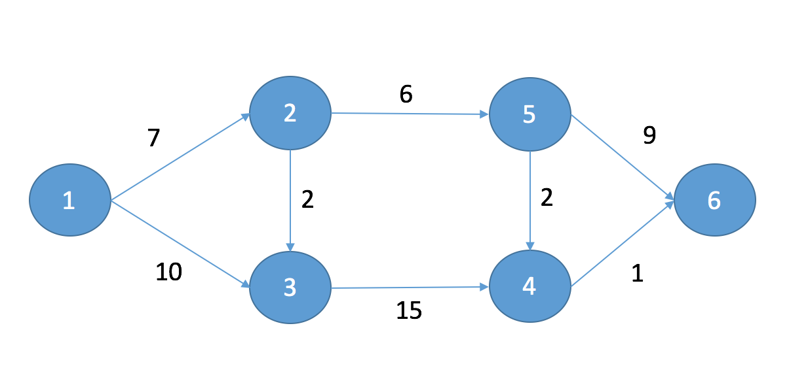

# Dijkstra

This algorithm finds the shortest path from a source to a destination in a graph. 

> I'm not very good at technical words so please let me know if I have got any wrong!

___

## Graph



A graph is made up of a series of cities, joined by roads. I have called these `nodes` and `routes`, each node has a unique ID and up to 10 `routes` going from it. 

```c
struct graph_node_t{
	graph_route_t 	neighbours[MAX_NEIGHBOURS];
	unsigned int 	num_neighbours;
	unsigned int 	shortest_distance_to_me;
	int 			id;
};
```

```c
struct graph_route_t{
	graph_node_t*	end;
	unsigned int	distance;
};
```

Each route has a distance and an end point. There is no need to know the start point for this as each route is monodirectional. That is to say, they are all _one way roads_! 

The graph is created on the stack. This is done purely because I know that I'm not going to have to add extra bits and pieces on the fly to this graph once initialised. It also reduces the complexity slightly - which is always nice.

## Queue

In order to know which city in my graph I haven't yet visited they are all added to the `priority_queue` where each item gets it's own `priority_queue_node_t`:

```c
struct priority_queue_node_t{
    priority_queue_node_t                   *next;
    graph_node_t                            *node;
};
```
A priority queue means that, instead of a normal FIFO queue it's a FI-Highest Priority-O. The highest priority in this case is the item with the shortest distance to it. If I was making a re-usable queue I'd probaby create a callback to calculate the priority when pushing a node to it, however here it's easy enough to just find the minimal item when trying to pop.

The key functionality for the `queue` is to find the minimal item and pop it out. This is the main part of the Dijkstra algorithm. The function `queue_pop` does this: 

```c
queue_node_t*	      queue_pop			(queue_node_t** front){
	if(*front == NULL) {
		return NULL;
	}
	queue_node_t* previous = NULL;
	queue_node_t* min = *front;
	queue_node_t* temp = *front;
	
	// only one item so return pointer to it
	if(temp->next == NULL){ *front = NULL; return min; }
	
	while(temp->next){
		if(temp->next->node->shortest_distance_to_me < min->node->shortest_distance_to_me){
			previous = temp;
			min = temp->next;
		}
		temp = temp->next;
	}
	
	// if previous is NULL then the first item is the shortest
	if(!previous){
		return queue_pop_front(front);
	}
	
	//pop
	previous->next = min->next;
	return min;
}
```

___

## Dijkstra's Algorithm

This is the cool bit which took me ages to get my noggin around. At the start there are no cities in the graph visited so they are all added to the `queue`.

```c
// The source has to have the shortest distance marked as 0 before starting
nodes[src]->shortest_distance_to_me = 0;
queue_node_t * not_visited = NULL;
	
// No nodes have been visited at this point so add them all the the queue
for(int i = 0; i < num_nodes; i++){
	queue_push_back(&not_visited, nodes[i]);
}
```

The nest thing it does is look in the queue of not visited nodes and get the one with the shortest distance to it. This also removes it from the queue:

```c
queue_node_t* current = queue_pop_min(&not_visited);
```

Then it looks at this `current` node and calculates the distance to it's neighbours by iterating over it's `graph_route_t` array and adding it's distance to the weight of the route. 

```c
const unsigned int distance_to_neighbour = current_graph->shortest_distance_to_me + current_graph->neighbours[n].distance;
```

If the neighbour's distance _aka thing at the end of the route_ is shorter than before then update it:

```c
if(distance_to_neighbour < current_graph->neighbours[n].end->shortest_distance_to_me){
	current_graph->neighbours[n].end->shortest_distance_to_me = distance_to_neighbour;
}
```

__Rinse and repeat__ by putting it in a while loop till everywhere is visited!

___

In hindsight I can't believe it took me so long to get my head around this but I learned tonnes and I got to use some different techniques which was pretty fun. I found ti really useful outputting the memory locations allocated and free'd to make sure that stuff was happening where I thought it should be. Loads of online tutorials use a 2D array to create the graph, which I wanted to avoid ... just because. I also found loads of online tutorials use variable names like `v` `u` and `setSPT` which means basically 0 to me. In all __10/10 would recommend to a friend__